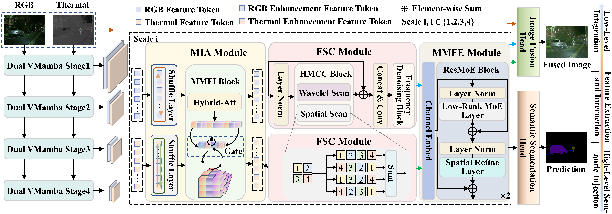

<div align="center">

# CMFS: CLIP-Guided Modality Interaction for Mitigating Noise in Multi-Modal Image Fusion and Segmentation

<h4>
  <a href='https://github.com/SuGuilin' target='_blank'>Guilin Su<sup>1</sup></a>
  ·
  <a href='https://github.com/NorahGreen/' target='_blank'>Yuqing Huang<sup>1,2</sup></a>
  ·
  <a  target='_blank'>Chao Yang<sup>1</sup></a>
  ·
  <a href='https://scholar.google.com/citations?user=7_VvbbAAAAAJ&hl=zh-CN&oi=ao/' target='_blank'>Zhenyu He<sup>1</sup></a>
</h4>

<p><sup>1</sup>Harbin Institute of Technology, Shenzhen &nbsp;&nbsp;<sup>2</sup>Peng Cheng Laboratory
<br><sup>*</sup>Corresponding author &nbsp;&nbsp;


<!-- [](https://arxiv.org/abs/2505.18581) -->
[]()


</div>


## 🌟 Introduction
*This repository is the official implementation of **CMFS**, a unified framework that leverages CLIP-guided modality interaction to mitigate noise in multi-modal image fusion and segmentation.*



Infrared-visible image fusion and semantic segmentation are pivotal tasks for robust scene understanding under challenging conditions such as low light. However, existing methods often struggle with high noise, modality inconsistencies, and inefficient cross-modal interactions, limiting fusion quality and segmentation accuracy. 

To address these challenges, we propose CMFS (**C**LIP-guided **M**ulti-modal **F**usion and **S**egmentation), a unified framework that leverages vision-language priors to enhance both fusion fidelity and semantic segmentation accuracy. By incorporating category text semantic guidance from CLIP, CMFS facilitates region-aware cross-modal interaction, improving the discrimination of foreground structures while suppressing modality-specific degradation.

## 🔬 Key Contributions
The proposed framework comprises: 

- Region-aware Modal Interaction Alignment module that integrates a VMamba-based encoder, a shuffle layer, and CLIP-guided interaction to enhance foreground saliency and suppress noise.

- Frequency-Spatial Collaboration module that leverages selective scanning and integrates wavelet-, spatial-, and Fourier-domain features to achieve adaptive denoising.

- Low-rank Mixture-of-Experts with dynamic routing to improve region-specific fusion and pixel-level segmentation accuracy.


## 🔥 News

🔥 __[June 24, 2025]:__ The paper and Code were released! \
🔥 __[April 29, 2025]:__ Our paper was accepted by **IJCAI 2025**!


## 🚀 QuickStart
### Installation
Environment Preparation: cuda=11.8, python=3.11, torch=2.3.1, gcc=11.3(for SSM enviroment).
Clone this repository, then create a `cmfs` conda environment and install the packages.

```bash
# clone repository
git clone https://github.com/SuGuilin/IJCAI2025-CMFS.git
# create conda env
conda create -n cmfs python=3.11
conda activate cmfs
# install packages
pip install -r requirements.txt
# install mamba
cd utils/dis_causal_conv1d && pip install -e . && cd ../..
cd utils/dis_mamba && pip install -e . && cd ../..
```

> 💡 **Note:** Installing Mamba may cost a lot of effort. If you encounter problems, we recommend following the official installation instructions provided by [Mamba](https://github.com/state-spaces/mamba) or [issues in Mamba](https://github.com/state-spaces/mamba/issues) instead.


### Dataset

After downloading the dataset([MFNet](https://drive.google.com/drive/folders/1bD5b4xXkDBasOLhupUBDdw2rq9oogbu_), [FMB](https://drive.google.com/drive/folders/1T_jVi80tjgyHTQDpn-TjfySyW4CK1LlF), [PST900](https://drive.google.com/file/d/1hZeM-MvdUC_Btyok7mdF00RV-InbAadm/view)), 
> The FMB dataset requires additional processing. You need to write a script to write the training set and test set image names to `train.txt` and `test.txt` respectively, and then mix them together according to the folders `Visible/`, `Infrared/`, and `Label/`.

please create a `/datasets` folder in the project directory and place the downloaded data inside. The directory structure should be as follows:
```bash
IJCAI2025-CMFS
├── assets
├── configs
├── dataloader
├── datasets
│   ├── FMB
│   ├── MFNet
│   └── PST900
├── engine
├── experiment
├── models
├── pretrained
├── utils
├── eval.py
├── README.md
├── train.py
└── requirements.txt
```
>💡 **Note:** If you wish to use a custom dataset path, simply modify the `dataset_path` field in `configs/base_config.yaml` accordingly and please orgnize the dataset folder in the following structure:


```bash
<datasets>
|-- <DatasetName1>
    |-- <RGBFolder>
        |-- <name1>.<ImageFormat>
        |-- <name2>.<ImageFormat>
        ...
    |-- <ModalXFolder>
        |-- <name1>.<ModalXFormat>
        |-- <name2>.<ModalXFormat>
        ...
    |-- <LabelFolder>
        |-- <name1>.<LabelFormat>
        |-- <name2>.<LabelFormat>
        ...
    |-- train.txt
    |-- test.txt
    |-- val.txt
|-- <DatasetName2>
|-- ...
```
`train.txt/val.txt/test.txt` contains the names of items in training/valing/testing set, e.g.:
```bash
<name1>
<name2>
...
```

### Running
1. Please download the pretrained [VMamba_Tiny_classification](https://github.com/MzeroMiko/VMamba/releases/download/%23v2cls/vssm1_tiny_0230s_ckpt_epoch_264.pth) weights and put it under `pretrained/`.

1. Multi-GPU distributed training:

   ```bash
   NCCL_P2P_DISABLE=1 \
   CUDA_VISIBLE_DEVICES="0,1" \
   python -m torch.distributed.launch \
       --nproc_per_node=2 \
       --master_port=29588 \
       train.py \
       -d 0,1 \
       -p 29588 \
       -n "dataset_name"
   ```

   Here, `dataset_name=mfnet/pst900/fmb`, referring to the four datasets.

   * `--nproc_per_node`: specifies how many GPUs to use
   * `-d`: specifies the GPU device ID to use
   * `-p`: specifies the port for init_process_group
   * `-n`: specifies the dataset to use, supports the following options: `mfnet`, `fmb`, `pdt900`

1. Single-GPU training:

   ```bash
   CUDA_VISIBLE_DEVICES="0" torchrun -m --nproc_per_node=1 --master_port=29501 train.py -d 0 -n "dataset_name"
   ```

1. Results will be saved in `experiment/dataset_name/exp/` folder，including `checkpoint/`、`tb/` and `train_output.log`

### Evaluation

1. Run the evaluation for segmentation by:

   ```bash
   CUDA_VISIBLE_DEVICES="0" python eval.py -n "dataset_name" -e "epoch_number"
   ```

1. Run the evaluation for fusion by:

   ```bash
   CUDA_VISIBLE_DEVICES="0" python eval_vision.py -n "dataset_name" -e "epoch_number"
   ```

## ✨ Acknowledgments
Our code is based on [MRFS](https://github.com/HaoZhang1018/MRFS), [VMamba](https://github.com/MzeroMiko/VMamba) and [CLIP](https://github.com/openai/CLIP). We sincerely appreciate for their contributions. 


## 🔗 Citation
Thank you for your interest in our work. If this work is useful to you, please cite it as follows:
```bibtex
@inproceedings{su2025cmfs,
  title={CMFS: CLIP-Guided Modality Interaction for Mitigating Noise in Multi-Modal Image Fusion and Segmentation},
  author={Guilin Su, Yuqing Huang, Chao Yang and Zhenyu He},
  booktitle={Proceedings of the Thirty-four International Joint Conference on Artificial Intelligence},
  year={2025}
}
```
